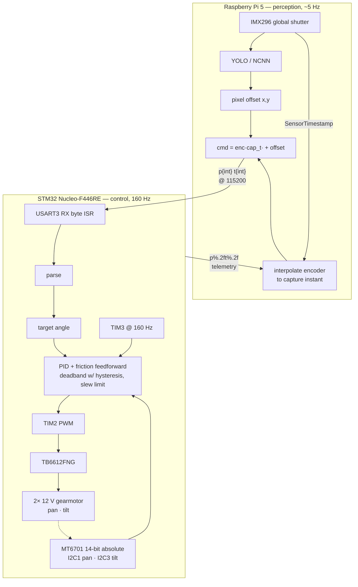

# Pan-tilt auto-tracking camera

Runs object detection on a Raspberry Pi 5 and a PID loop on an STM32 Nucleo-F446RE to track a hand's motion

## Concepts applied
- **PID Control**
- **UART, I2C**
- **Interrupts, Timers**
- **Pulse Width Modulation (PWM)**
- **State Machines**

## Architecture

- **STM32 Nucleo-F446RE** — real-time motor control: UART command parsing, I2C communication with encoders,
  PWM generation, direction logic.
- **Raspberry Pi 5** — vision pipeline that converts
 detected-object pixel offsets into absolute angle commands.
- **TB6612FNG** — dual H-bridge driver.
- **2× 12V 120RPM 37mm gear motors** — pan and tilt axes.
- **2x MT6701 Magnetic Encoder** - absolute angle reads.

## Roadmap

- [x] Open-loop UART motor control
- [x] Pi-to-STM32 UART link validation (end-to-end echo confirmed)
- [x] Closed-loop PID with MT6701 encoder feedback
- [x] Full vision pipeline → UART → PID → motion (YOLO vision model to track hand)
- [ ] Gesture-based mode switching (to do something cool like shoot a nerf bullet on a closed fist)
