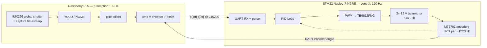

# Pan-tilt vision-tracking robot — real-time PID on STM32, YOLO on Raspberry Pi

Runs object detection on a Raspberry Pi 5 and a PID loop on an STM32 Nucleo-F446RE to track a hand's motion

## Demo

https://github.com/user-attachments/assets/c4a773b6-c7c7-4891-bf52-8f503c4bdf67

## CubeMX GPIO Pin Assignment

## Architecture

- **STM32 Nucleo-F446RE** — real-time motor control: UART command parsing, I2C communication with encoders,
  PWM generation, direction logic.
- **Raspberry Pi 5** — vision pipeline that converts
 detected-object pixel offsets into absolute angle commands.
- **TB6612FNG** — dual H-bridge driver.
- **2× 12V 120RPM 37mm gear motors** — pan and tilt axes.
- **2x MT6701 Magnetic Encoder** - absolute angle reads.

## Problems Faced + Solutions

**Time misalignment led to tracking instability.** `cmd = encoder + offset`
only works if the moment the absolute position from the encoder is read at the same time the offset is computed. Previously, it wasn't: the offset was measured at frame capture, but the encoder was read after ~200 ms of inference. If the motor has already moved for ~200ms towards the previous target when the new command is sent, the unintended result is sustained hunting. The solution was to interpolate the encoder back to the frame's capture timestamp from a telemetry history buffer. This eliminated the time between when the absolute angle is measured and when the pixel offset is computed.

**Friction feedforward from open-loop system ID.** The gearmotors need > 85 duty cycle to break stiction, so a pure PID output stayed below the breakaway threshold on small errors. An open-loop duty/velocity sweep gave the minimum duty to move the motors (~85 counts) and the
slope (kv = 1.6 counts per °/s). Adding both as feedforward terms meant the controller starts every move above breakaway instead of ramping into it. The result: the axis moves for 98% of frames where the target was moving, up from 38%.

**Backlash sets the deadband.** Pan carries ~5–6° of gearbox backlash; closing tighter 
than that produces jerky motion, so the deadband is sized to contain it. It's bypassed 
entirely during continuous tracking so the axis never gets stuck in stiction while it's moving

## Roadmap

- [x] Open-loop UART motor control
- [x] Pi-to-STM32 UART link validation (end-to-end echo confirmed)
- [x] Closed-loop PID with MT6701 encoder feedback
- [x] Full vision pipeline → UART → PID → motion (YOLO vision model to track hand)
- [ ] Gesture-based mode switching (to do something cool like shoot a nerf bullet on a closed fist)
