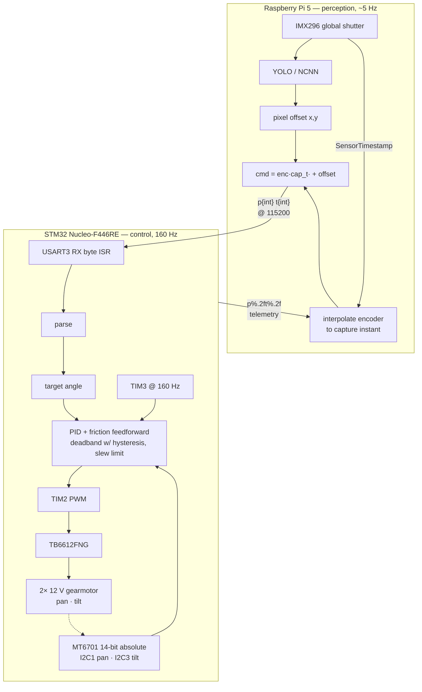

# Pan-tilt auto-tracking camera

Runs object detection on a Raspberry pi 5 and a PID loop built on an STM32 Nucelo-f446re to track a hand's motion

## Architecture

Two processors split by timing requirement: perception on the Pi where a
150–200 ms inference budget is acceptable, control on the STM32 where a
160 Hz loop has to be deterministic.

- **STM32 Nucleo-F446RE** — real-time motor control: UART command parsing,
  PWM generation, direction logic.
- **Raspberry Pi 5** — command source; vision pipeline that converts
 detected-object pixel offsets into angular commands
- **TB6612FNG** — dual H-bridge driver.
- **2× 12V 120RPM 37mm gear motors** — pan and tilt axes.

## Roadmap

- [x] Open-loop UART motor control
- [x] Pi-to-STM32 UART link validation (end-to-end echo confirmed)
- [x] Closed-loop PID with MT6701 encoder feedback
- [x] Full vision pipeline → UART → PID → motion (YOLO vision model to track hand)
- [ ] Gesture-based mode switching (to do something cool like shoot a nerf bullet on a closed fist)
